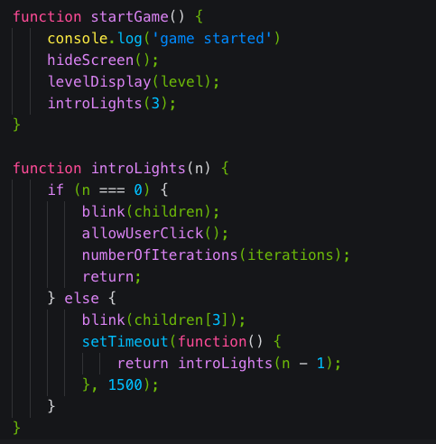

<header>
<h1><a href='#'>Illuminate</a></h1>

Illuminate is a game that tracks visual
</header>
<h3>Technologies Used</h3>
<ul>
<li>CSS</li>
<li>Bootstrap</li>
<li>jQuery</li>
<li>JavaScript</li>
</ul>
<h3>Code I'm proud of</h3>

<h3>Contact</h3>
<a href='https://www.github.com/nzoLogic'>GitHub</a>
